# Qt Tree View Tutorial
This is a tutorial on how to use a QTreeView with a custom model. I'm also going to do a few tricks with the toolbar. Note that for my purposes, I am only producing Mac desktop apps. I can't promise this works in other environments, but it should.

As of May 28th, 2019, this demo is complete, but I am NOT a Qt expert, and there might be significant flaws. If you see some, please email me at jpl@showpage.org, or submit a pull request that addresses it.

## Assumptions
I assume:

1. You know how to program C++.
2. You have already installed Qt and have done a few of the Hello World demos.

# Create and Edit Your GUI

## Create a project.
From Qt Creator, go to the Welcome tab (upper left corner). Go to Projects and then do a New Project. This is a Qt Widgets Application. You should understand the next few pages in the wizard. Then use a QMainWindow as your base class.

## Edit the .ui.
Expand the list of Forms and double-click MainWindow.ui.

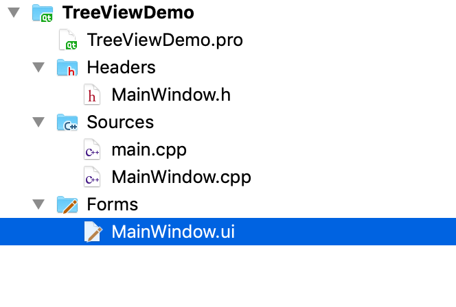

## Add the Tree View.
Within the Design window, underneath "Item Views" you can find Tree View. Drag it to your Main Window. Then give your window a layout. I just used Vertical Layout.

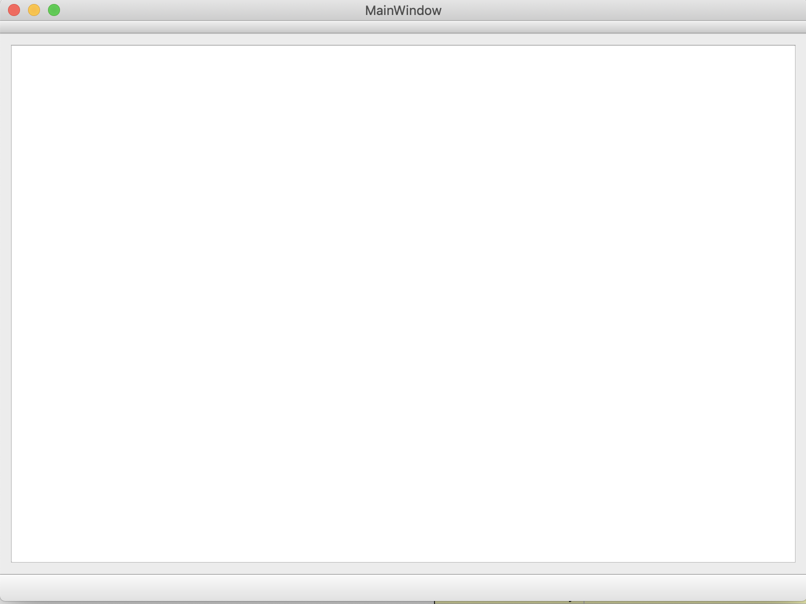

It's boring, but your Tree View is there.

## Add an action for fiddling with the data
I went out to iconshock.com. They have tons of libraries of really cool icons. You can pay for the professional ones or use the free ones. My demo app uses the Lumina icon from the General section, the "next.png" file.

Create a subdirectory of your project directory. I called mine Images. I do this from the command prompt. I then copied my icon file into the subdirectory. This happens outside of Qt Creator.

### Create Resources File
You have to add a Resources file. This isn't hard, but it's entirely unobvious. From the Edit window, right-click your project name (TreeViewDemo, or whatever you called it), and click Add New. You can also do this from the File menu item.

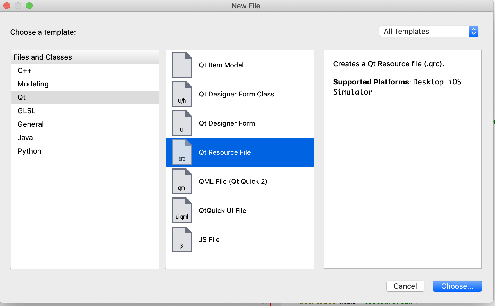

You are creating a Qt Resource File. Click Choose. Then give it a name. I called it Images to match the name of my subdirectory, but there's no need for them to be the same. You could call it Icons. I like them to be the same.

This creates a new section, Resources, and your file, Images.qrc. If you look at your project directory (ls from the command line), you'll see Images.qrc as a file.

This also leaves you on the Resource File editor, but you can always double-click Images.qrc if you need to get back here.

Now we have two more steps:

1. Create a prefix
2. Add your image files

Click Add and Add a Prefix

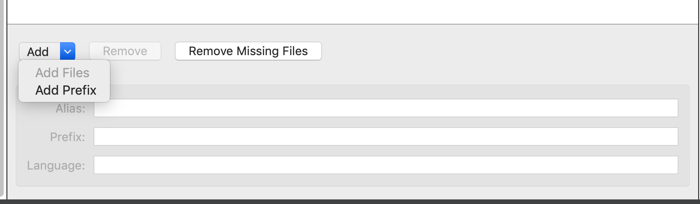

For the prefix text, I just overwrote the default contents with /Images.

Then click Add again and do Add->Files. This pops up a file browser already open to your project directory. Navigate to your Images subdirectory and select all the files.

The main area of your window now looks something like this:

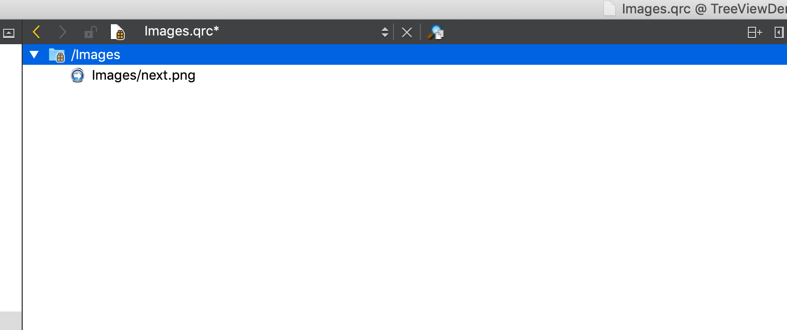

Your resource file is done. If you add more icons later, you can double-click Images.qrc and add more files.

### Create a Menu Action
Hopefully you did a Menu tutorial, but I'll walk you through it. Double click MainWindow.ui. At the top it says Type Here.

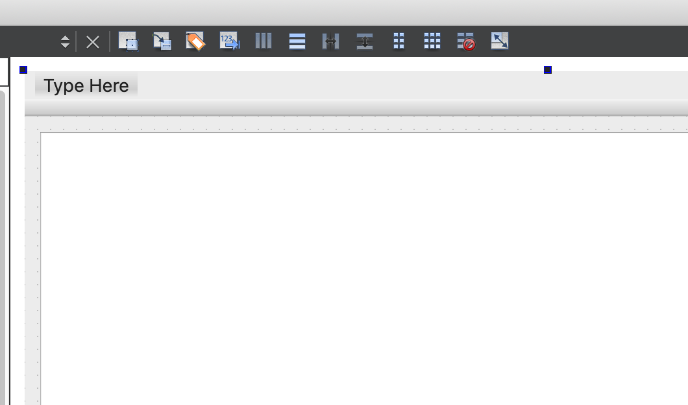

I typed Action and then Change Data.

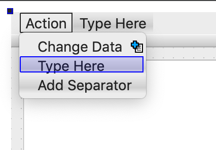

At this point you can run the app. You'll have a menu of Action with an item of Change Data. On a Mac, it's way at the top left corner of your display, NOT inside the program window. Mac menus all go at the top of the display.

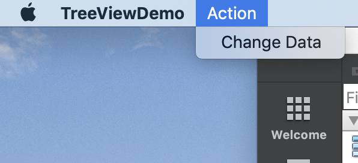

If you click it, nothing happens. We're going to add the icon and then put in some dummy code. Close the window to end the program and go back to Qt Creator. Find this in the designer (you should still be in Design mode of MainWindow.ui):

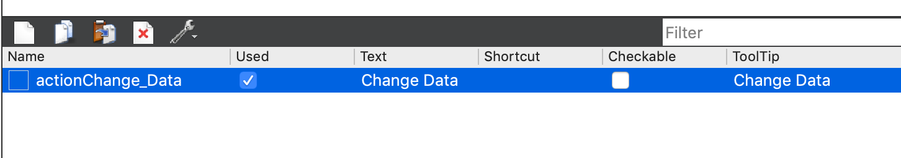

Double-Click (or right-click and pick Edit) the actionChange_Data item. It will have a different name if you typed something other than Change Data when creating the menu. You get this window:

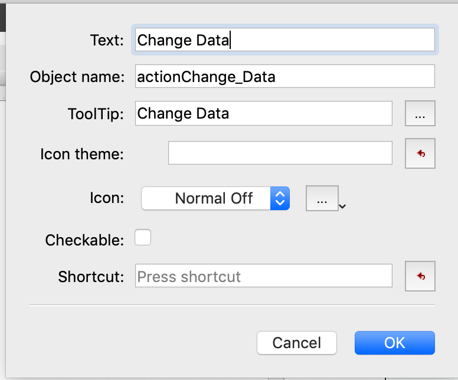

All we're worrying about is changing the icon. This part is a little odd. Beside icon is a combo box. For now, leave that alone. It's an exercise for the reader to set different icons for different uses. We're just going to set one.

Click the little down triangle to the right. It's small. It gives you a popup menu. Do "Choose Resource". You should get this page:

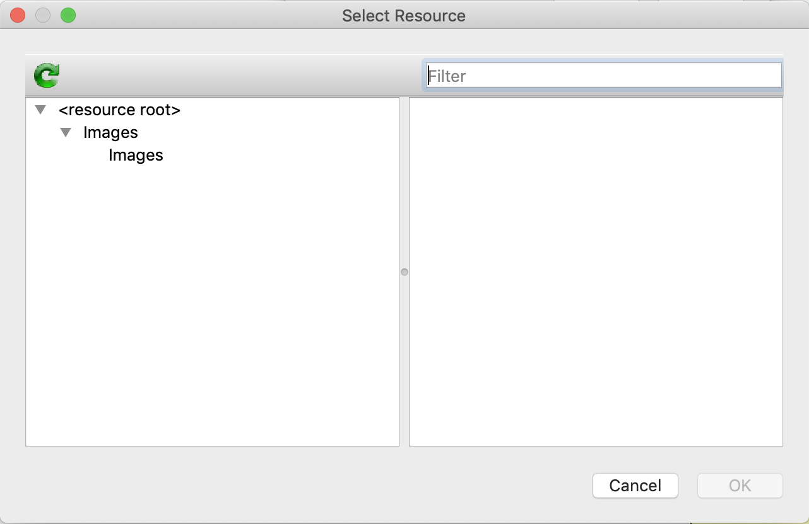

Click on images, and it will show all the images you put into Images.qrc. There's only one for now for me, so I click on "next.png" and hit OK. That hides the Choose Resource window, makes a small change to your Edit window. Click OK.

Run the app and check the menu. Your icon will be there. Cool.

### Add Dummy Action
Close the program (if you're testing it) and go back to the Design mode for MainWindow.ui. Down in the area for actionChange_data, right click and choose Go To Slot.

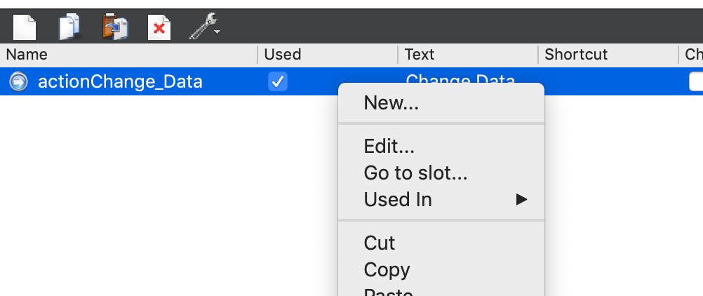

This pops up a "What slot do you care about" page. For this, the default should already be QAction -> triggerd(). Make sure that's highlighted and hit OK.

This will LEAVE Design mode and take you to MainWindow.cpp. It will have automatically produced some code here and in your .h file.

```
#include <iostream>

#include "MainWindow.h"
#include "ui_MainWindow.h"

using namespace std;

MainWindow::MainWindow(QWidget *parent) :
    QMainWindow(parent),
    ui(new Ui::MainWindow)
{
    ui->setupUi(this);
}

MainWindow::~MainWindow()
{
    delete ui;
}

void MainWindow::on_actionChange_Data_triggered()
{
    cout << "Triggered!" << endl;
}
```

This file has VERY minimal editing on my part. At the top, I included iostream. I added using namespace std. This is because I like using cout instead of qDebug(), and that's because I use a lot of libraries that already exist, and they use std::string not, QStrings. This is a Joe thing. Do what works for you.

Run the program. Pick the menu option. Qt Creator will open a section for "Application Output" and you'll see you've been triggered.

What if my cout doesn't show up?

```
cout << "Triggered\n";
```

That won't work. I don't know why, but if you do that, you won't see your output for a while. It needs to be endl. Note if you don't use a "using namespace std", you'll need to say:

```
std::cout << "Triggered" << std::endl;
```

Which is ugly.

At this point your menu item exists and has dummy code. Note: if you do "Go to Slot" a second time for the same action, it creates a new copy of your code, and you'll have it twice. This tends to cause compile problems.

### Create the Tool Bar
Let's create a tool bar and do something cool with it. This part is fun and easy.

Go back to Design mode for MainWindow.ui. Click and drag your actionChange_Data thing from the bottom up to just underneath the menubar. There should be an empty toolbar there waiting to take it.

If your window doesn't seem to have a toolbar, you can check over on the right:

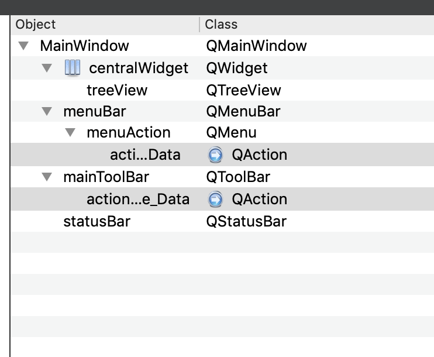

See where it says "mainToolBar". Yours could be called something else, but it will be of type QTOolBar. If you don't have one, right click the Main Window in the widget list (that last screen shot), and pick Add Tool Bar. Note: you can also do it from the Design window on the left side.

Once you have dragged the action to the toolbar, the design view looks like this:

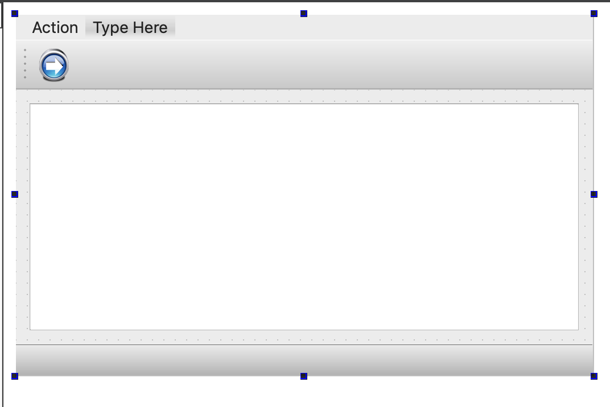

You can see the menu and the toolbar with the next.png icon on it. Run it and click the icon in the toolbar. You'll get triggered.

Something cute: that line of dots is a handle. You can move the toolbar! You can even float it somewhere else. Way cool.

Go back to the design window for MainWindow.ui. In the widget list, top right side, click the QToolBar. This gives you the settings for the toolbar. Scroll to the bottom of the settings where it says QToolBar.


You can click off movable if you want and floatable if you want. For this demo, I changed the button style to ToolButtonTextUnderIcon.

### Do Something Cool With the Tool Bar
Switch to Edit mode (the Edit window in the toolbar of Qt Creator, upper left corner). Then double-click MainWindow.cpp.

Change the code for the constructor to this:

```
MainWindow::MainWindow(QWidget *parent) :
    QMainWindow(parent),
    ui(new Ui::MainWindow)
{
    ui->setupUi(this);

    auto toolbar = ui->mainToolBar;
    removeToolBar(toolbar);
    addToolBar(Qt::LeftToolBarArea, toolbar);
    toolbar->show();
}
```
Note: if your toolbar has a different name, this code will complain on the auto toolbar= line. That name needs to match the name from the design mode's widget list for your QToolBar.

What this code is remembers a handle to the toolbar, then removes it. And after all the work we did to create it! But then we add it back in, but we give it a starting location of the left side. toolbar->show is required for it to appear.

Run:

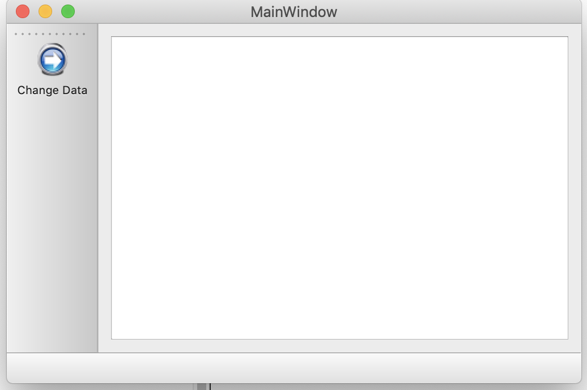

I do this just because it's cool. We're done doing GUI work for a while.

# Create Your Data
I have a lot of code that is basically an array of objects, and those objects have more objects. You know: a tree. These are plain objects, and I want to use them directly. You probably have something similar, or you wouldn't be here. I don't want to translate all that data into a new structure just to display it, so that's what makes all of this tricky.

Note: for a variety of reasons that might be stupid, but it's what I do, I store points to my objects. I have a class I use called PointerVector. If you check out the code, you'll see PointerVector.h in the project. Wherever you see ```PointerVector<Foo>```, you could just do ```std::vector<Foo *>``` instead. Or do what works for you. You wouldn't be here if you're learning C++. You'd be finding a C++ tutorial.

For this demo, I am going to create objects TopData, MiddleData, and ChildData. It's just a demo. I'll toss a few attributes on them. You can look the class definitions if you want. I'm not going to include the code in this README.

File -> New File or Project-> C++ -> C++ Class and enter your info.

I'm going to cheat and put all three definitions inside TopData.h and TopData.cpp. It's small, and this isn't Java. We can do this. To avoid dealing with getters and setters, I'll make my data public, but clearly in the real world, that's not always wise.

Go look at MainWindow.cpp to see how I populate the data. It's just data. It could be anything. But in short, I did this in MainWindow.h:

```
#include "TopData.h"
...
private:
    Ui::MainWindow *ui;
    PointerVector<TopData> topData;
```

Standard C++. I did some data construction just to populate some random data.

## Something Very Annoying
Okay, now I'm going to say something very, very annoying about your data. You must be able from a raw pointer be able to identify what type of data is and navigate to the parent. This can be done in a few ways.

If your entire tree consists of homogenous data (like a File entry from the file system), then the data type is fixed, and then you only need a pointer to the parent directory for each file. That makes it easy.

My example data is NOT homogenous. I have 3 different classes. At various points in some of the methods, all I have is a pointer, and this isn't Java, so I can't query the object to see what type it is. So I can do a few things.

1. You can subclass from a common type, and have that type know the Type. This is what I did.
2. You can write a wrapper class that holds all the data. For instance, in addition to your normal data, you would create a bunch of Node objects that has a distinct pointer to each type of data you might have, as well as a Parent Node pointer.
3. You could probably create some sort of map based on the pointer that tells you the datatype and parent.

You'll see that my data did a common subclass. I could have done it other ways, but they are ugly.

# Create Your Model
You are going to need a model. This is the trickiest part of all of this. The model is the interface between your data (which can be in whatever form you like -- C++ stuff) and the actual GUI. So the model is very specific to Qt.

In your project, File -> New File -> C++ Class. I called my MyDataModel. Here's MyDataModel.h.

```
#ifndef MYDATAMODEL_H
#define MYDATAMODEL_H

#include <QAbstractItemModel>
#include "TopData.h"

/**
 * This is the model used to display our data.
 */
class MyDataModel: public QAbstractItemModel
{
    Q_OBJECT
private:
    PointerVector<TopData> & myData;

public:
    MyDataModel(QObject *parent, PointerVector<TopData> *vec);

    int rowCount(const QModelIndex &parent = QModelIndex()) const override;
    int columnCount(const QModelIndex &parent = QModelIndex()) const override;
    bool hasChildren(const QModelIndex &) const override;
    QVariant headerData(int section, Qt::Orientation orientation, int role) const override;
    QVariant data(const QModelIndex &index, int role = Qt::DisplayRole) const override;

    QModelIndex index ( int row, int column, const QModelIndex& parent = QModelIndex()) const override;
    QModelIndex parent ( const QModelIndex& index ) const override;
};

#endif // MYDATAMODEL_H
```

Notice that I inherit from QAbstractItemModel. Do NOT inherit from QAbstractTableModel. That is going to get you into trouble. Notice the Q_OBJECT line at the top of the class definition.

I do a little standard C++ stuff to keep a reference to my data.

And then I define 7 methods.

## Constructor
Standard C++ stuff:

```
MyDataModel::MyDataModel(QObject *parent, PointerVector<TopData> *vec)
    : QAbstractItemModel(parent), myData(*vec)
{
}
```

## columnCount()
Let's show the easy one:

```
#define MAX_COLUMNS 4

int MyDataModel::columnCount(const QModelIndex &) const {
    return MAX_COLUMNS;
}
```

Trivial.

## Header Information is also pretty trivial:

```
#define COLUMN_NAME 0
#define COLUMN_STATUS 1
#define COLUMN_ADDRESS 2
#define COLUMN_AGE 3

QVariant MyDataModel::headerData(int section, Qt::Orientation, int role) const {
    QVariant retVal;
    if (role == Qt::DisplayRole){
        switch (section) {
            case COLUMN_NAME: retVal = "Name"; break;
            case COLUMN_STATUS: retVal = "Status"; break;
            case COLUMN_ADDRESS: retVal = "Address"; break;
            case COLUMN_AGE: retVal = "Age"; break;
            default: retVal = "Unknown"; break;
        }
    }
    return retVal;
}
```

You need that if statement. Role can be passed in for other things I haven't learned about yet, but this works for this example.

## rowCount()
This method isn't too horrible, although due to our structure, it's a little gross in places. But it's not bad.

Basically you give the number of children based on this parent. I think the comments here explain what is happening. This method is going to be called once with parent.isValid() set false, and you return the count of your top level data. In my case, this is the size of my TopData vector.

It then gets called recursively for each of those rows, and for the rows they also reference. In this case, you have a parent, and the parent could have a parent, and that can continue as deeply as you nest.

There are better ways to code this as you start nesting, but this works.
```
int MyDataModel::rowCount(const QModelIndex &parent) const {
    int retVal = 0;

    if (parent.column() <= 0) {
        // If the parent isn't valid, this is the number of immediate children of the
        // root, which for our data model is the count of TopData objects in our vector. Easy.
        if (!parent.isValid()) {
            retVal = static_cast<int>(myData.size());
        }

        // At this point, we're working on drill downs. We can be for:
        // -A TopData Row -- our parent is the root.
        // -A MiddleData row
        // -A ChildData row.
        //
        // There's probably a more clever way to write this using lambdas or something, but this works.

        else if (!parent.parent().isValid()) {
            // Our parent is the root (which is handled above, so we're a TopData, and
            // we just return the number of children.
            TopData *td = myData.at(parent.row());
            retVal = static_cast<int>(td->middleData.size());
        }

        // This is a little gross.
        else if (!parent.parent().parent().isValid()) {
            // We're a MiddleData.
            TopData *td = myData.at(parent.parent().row());
            MiddleData *md = td->middleData.at(parent.row());
            retVal = static_cast<int>(md->children.size());
        }
    }

    return retVal;
}
```

## hasChildren()
```
/**
 * Does this node have children?
 */
bool MyDataModel::hasChildren(const QModelIndex &index) const {
    bool retVal = true;

    if (!index.isValid()) {
        // We're for the invisible root, which of course has children.
    }
    else if (!index.parent().isValid()) {
        // We don't have a parent, so we're a TopData object. We can retrieve the object and
        // return false if we have no middle data, but I'm just going to return true.
    }
    else if (!index.parent().parent().isValid()) {
        // Like rowCount(), this is getting gross, but it's just a demo.
        // In this case, we're a middle data. We have a parent, but no grandparent.
        // We can return true.
    }
    else {
        // We're a ChildData.
        retVal = false;
    }

    return retVal;
}
```
Again, the code is a little gross. You could make this smarter and not display open dialogs for any rows that have no child data, but I decided to just pay attention to what structure I have.

## data()

```
QVariant MyDataModel::data(const QModelIndex &index, int role) const {
    QVariant retVal;

    int row = index.row();
    int column = index.column();
    if (role == Qt::DisplayRole && index.isValid() && row >= 0 && column >= 0) {
        BaseData *baseData = static_cast<BaseData *>(index.internalPointer());
        if (baseData != nullptr) {
            switch (baseData->type) {
                case BaseData::Type::CHILD: {
                    ChildData *childData = static_cast<ChildData *>(baseData);
                    switch(column) {
                        case COLUMN_NAME: retVal = QString::fromStdString(childData->name); break;
                        case COLUMN_AGE: retVal = childData->age; break;
                    }
                    break;
                }
...
            }
        }
    }
    return retVal;
}
```

This works because the QModelIndex will have a pointer to the object. However, the next two methods are frustrating.

## index()
The index() method takes the row and column as well as the parent index object. Note that the parent can be the invisible root, at which point it will be invalid.

The first if-statement may not be necessary. I trapped it to be careful. The second if against parent.isValid() checks if the parent is the invisible root. If so, then we're a top-level object (TopData) and we can directly dereference our array, as you see in the code.

It is absolutely critical that createIndex receive a pointer to our object. And you'll see that we're about to use it.

If we're not a top level, then we're a child. We grab that internal pointer that was passed to createIndex when our TopData object was created. That if-statement you see after grabbing baseData was put in while I was debugging problems. It's not necessary.

We then look at the type of object we're pointing to so that we know how to find the child. Other than that, the code is pretty obvious.
```
/**
 * This creates a QModelIndex for a particular cell. Our internal data points to an IndexData.
 */
QModelIndex MyDataModel::index ( int row, int column, const QModelIndex &parent) const {
    if (row < 0 || column < 0) {
        return QModelIndex();
    }

    // If this is top level...
    if (!parent.isValid()) {
        if (row >= static_cast<int>(myData.size()) ) {
            return QModelIndex();
        }
        TopData * topData = myData.at(row);
        return createIndex(row, column, topData);
    }

    // As the parent is valid, we can use his internalPointer.
    BaseData * baseData = static_cast<BaseData *>(parent.internalPointer());
    if (baseData == nullptr) {
        cout << "We have a legitimate parent, but his internalPointer is null!" << endl;
        exit(0);
    }

    // The parent can either be a TopData or MiddleData.
    void *ptr = nullptr;
    if (baseData->type == BaseData::Type::TOP) {
        TopData *td = static_cast<TopData *>(baseData);
        ptr = td->middleData.at(row);
    }
    else if (baseData->type == BaseData::Type::MIDDLE) {
        MiddleData *md = static_cast<MiddleData *>(baseData);
        ptr = md->children.at(row);
    }

    return createIndex(row, column, ptr);
}
```

## parent()
This one annoys the crap out of me. It's a pain in the ass. Here's the code. Explanation below.

```
QModelIndex MyDataModel::parent(const QModelIndex& index) const {
    QModelIndex retVal;
    if (!index.isValid()) {
        return retVal;
    }

    BaseData * baseData = static_cast<BaseData *>(index.internalPointer());
    if (baseData == nullptr) {
        return retVal;
    }

    BaseData *parent = baseData->parent;
    if (parent == nullptr) {
        // No parent means it's the root.
        return retVal;
    }

    int loc = -1;
    if (parent->type == BaseData::Type::TOP) {
        loc = myData.indexOf(static_cast<TopData *>(parent));
    }
    else if (parent->type == BaseData::Type::MIDDLE) {
        MiddleData *middleParent = static_cast<MiddleData *>(parent);
        TopData *topData = static_cast<TopData *>(middleParent->parent);
        loc = topData->middleData.indexOf(middleParent);
    }

    return createIndex(loc, 0, parent);
}
```

This is stupid. Really stupid. I *think* the internals call this code when you call index.parent(), though, which is insane. It should keep them, but I don't think it does. So I think these are getting created all the time. Yuck.

Anyway...

We need to return a QModelIndex for our PARENT. This is why internalData must be set, and why we must know the data type and how to get to our parent.

After that, the code is kind of easy.

# Tie Your Model To Your View
MainWindow.h includes the data model include and then does this:

```
MyDataModel * model;
```

That part is easy. So is this part:

```
MainWindow::MainWindow(QWidget *parent) :
    QMainWindow(parent),
    ui(new Ui::MainWindow),
    model(new MyDataModel(nullptr, &topData))
{
  ui->setupUi(this);
  ui->treeView->setModel(model);
  ...
  // Columns are allocated evenly, except the last which by default gets the
  // stretch. This lets me make two of them wider.
  ui->treeView->setColumnWidth(0, ui->treeView->columnWidth(0) * 1.5);
  ui->treeView->setColumnWidth(2, ui->treeView->columnWidth(2) * 2);
}
```

That's all it takes, once your model is set up. You create the model, feed it some sample data however you want, and then tell the treeView to use it.

# Handle Edits
I added a timer event to update data:

```
QTimer::singleShot(5000, this, SLOT(updateData()));
```

That method simply does this:

```
void MainWindow::updateData() {
    on_actionChange_Data_triggered();
    QTimer::singleShot(5000, this, SLOT(updateData()));
}

void MainWindow::on_actionChange_Data_triggered()
{
    TopData * td = topData.at(0);
    MiddleData * md = td->middleData.at(0);
    md->name = md->name + ".";

    md->createChildData("Update", 10);

    ui->treeView->dataChanged(QModelIndex(), QModelIndex());
    model->layoutChanged();
}
```

This is the same trigger that happens if you hit the icon in the toolbar. What this does...

The first few lines munge the data. I append dots to the name of a middle data line and then I add another child to it.

The final two lines tell the view that the data has changed PLUS get the model to emit the "layout changed" signal, which is necessary if you add or remove rows. Without layoutChanged(), the view saw the dots being added, but didn't see the new row being added.

It turns out that if you do layoutChanged(), you don't need the dataChanged() call. So in my checked-in code, that call is commented out.
